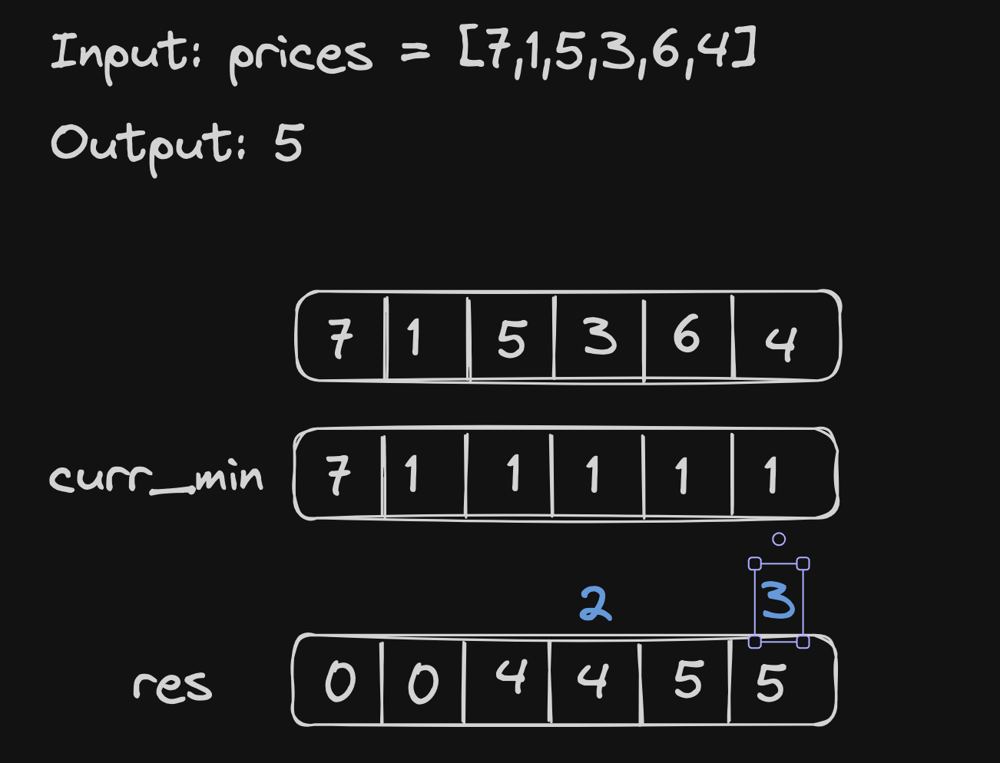

# <a href="https://leetcode.com/problems/best-time-to-buy-and-sell-stock/description/?envType=study-plan-v2&envId=top-interview-150">121 Best Time to Buy and Sell Stock</a>

### Description

> Tags: *Array, Dynamic Programming*

You are given an array `prices` where `prices[i]` is the price of a given stock on the `i`th day.

You want to maximize your profit by choosing a single day to buy one stock and choosing a different day in the future to sell that stock.

`Return the maximum profit` you can achieve from this transaction. If you cannot achieve any profit, `return 0`.

 

Example 1:
```
Input: prices = [7,1,5,3,6,4]
Output: 5
Explanation: Buy on day 2 (price = 1) and sell on day 5 (price = 6), profit = 6-1 = 5.
Note that buying on day 2 and selling on day 1 is not allowed because you must buy before you sell.
```
Example 2:
```
Input: prices = [7,6,4,3,1]
Output: 0
Explanation: In this case, no transactions are done and the max profit = 0.
```

> Understand the problem

1. `prices[i]` = prices of given stock on `i`th day
1. maximise profit
1. you must buy before sell
1. buy at low, sell at high

> Drawings



> to code

- find `curr_min` at each day
- update the res with `max(res, (curr - curr_min))`
