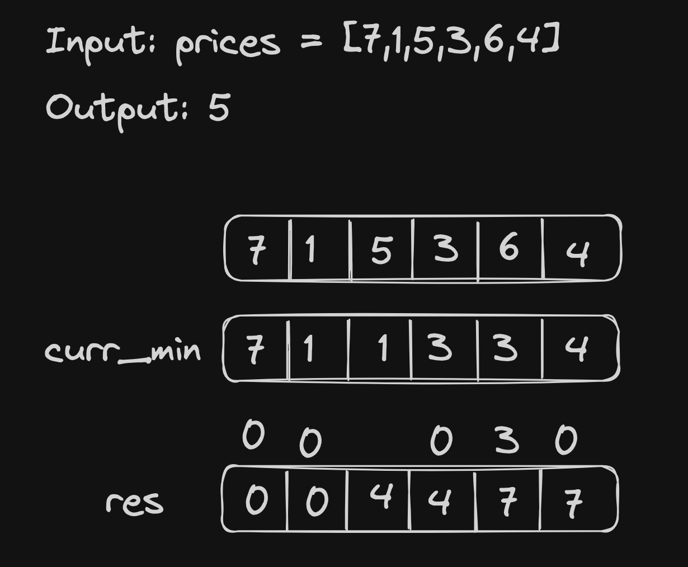

# <a href="https://leetcode.com/problems/best-time-to-buy-and-sell-stock-ii/?envType=study-plan-v2&envId=top-interview-150">122 Best Time to Buy and Sell Stock II</a>

### Description

> Tags: *Array, Dynamic Programming, Greedy*


You are given an integer array `prices` where `prices[i]` is the price of a given stock on the `i`th day.

On each day, you may decide to buy and/or sell the stock. You can only hold at most one share of the stock at any time. However, you can buy it then immediately sell it on the same day.

Find and return the ***maximum profit*** you can achieve.

 

Example 1:
```
Input: prices = [7,1,5,3,6,4]
Output: 7
Explanation: Buy on day 2 (price = 1) and sell on day 3 (price = 5), profit = 5-1 = 4.
Then buy on day 4 (price = 3) and sell on day 5 (price = 6), profit = 6-3 = 3.
Total profit is 4 + 3 = 7.
```
Example 2:
```
Input: prices = [1,2,3,4,5]
Output: 4
Explanation: Buy on day 1 (price = 1) and sell on day 5 (price = 5), profit = 5-1 = 4.
Total profit is 4.
```
Example 3:
```
Input: prices = [7,6,4,3,1]
Output: 0
Explanation: There is no way to make a positive profit, so we never buy the stock to achieve the maximum profit of 0.
``` 
> Understand the problem
1. try to go through - Best Time to Buy and Sell Stock
1. here, we can buy and sell as many times
1. can hold atmost one stock at a time

> Drawings



> to code

- `res = 0` to store the max profit
- loop through the array and keep track of `curr_min` at every point
- add the difference of `curr - curr_min` to `res`


