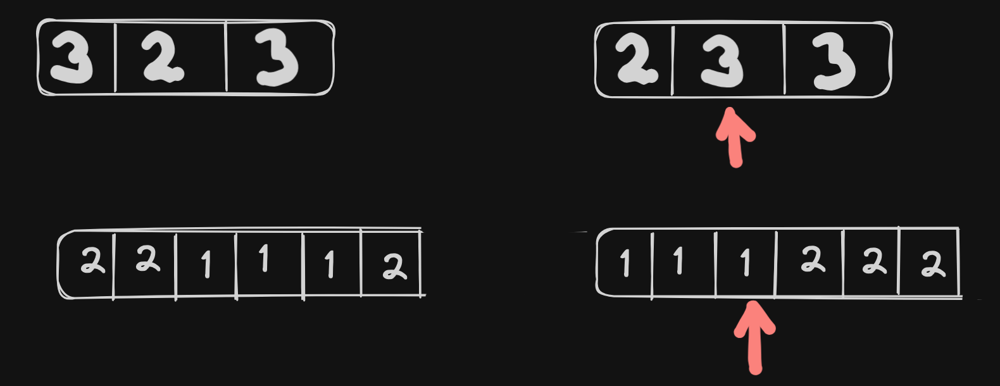

# <a href="https://leetcode.com/problems/majority-element/?envType=study-plan-v2&envId=top-interview-150">169. Majority Element</a>

Given an array `nums` of size `n`, return the majority element.

The majority element is the element that appears more than `⌊n / 2⌋` times. You may assume that the majority element always exists in the array.

 

Example 1:
```
Input: nums = [3,2,3]
Output: 3
```
Example 2:
```
Input: nums = [2,2,1,1,1,2,2]
Output: 2
```

> Understand the problem
1. majority element is the element that appears more than `[n/2]` times

> Drawings



> to code
- sort the array - the majority element will always at the center