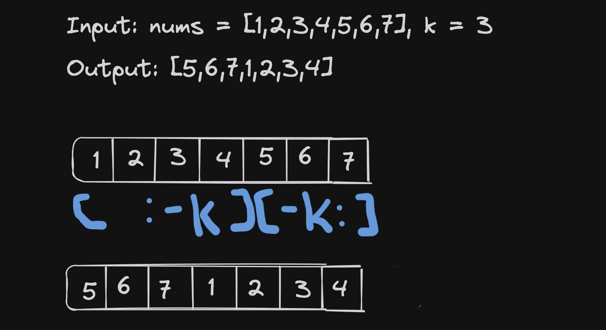

# <a href="https://leetcode.com/problems/rotate-array/?envType=study-plan-v2&envId=top-interview-150">189 Rotate Array</a>


### Description

> Tags: *Array, Two Pointers, Math*

Given an integer array nums, rotate the array to the right by k steps, where k is non-negative.

 

Example 1:
```
Input: nums = [1,2,3,4,5,6,7], k = 3
Output: [5,6,7,1,2,3,4]
Explanation:
rotate 1 steps to the right: [7,1,2,3,4,5,6]
rotate 2 steps to the right: [6,7,1,2,3,4,5]
rotate 3 steps to the right: [5,6,7,1,2,3,4]
```
Example 2:
```
Input: nums = [-1,-100,3,99], k = 2
Output: [3,99,-1,-100]
Explanation: 
rotate 1 steps to the right: [99,-1,-100,3]
rotate 2 steps to the right: [3,99,-1,-100]
```

> Understand the problem
1. k is non-negative
1. k can have value > `len(nums)`
1. rotate the array to right by k steps == `shift the elemnts to k position`
1. circular right shift ?

> Drawings



> to code
- find the modulus of k
- use array index slicing `[::]` to shift the array to k position right
