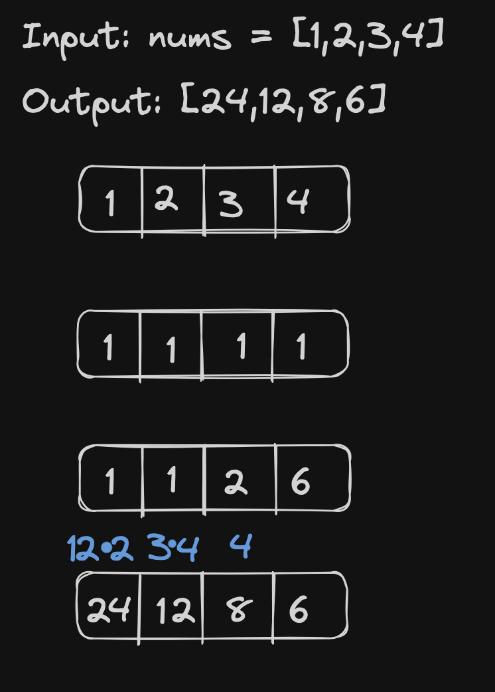

# <a href="https://leetcode.com/problems/product-of-array-except-self/?envType=study-plan-v2&envId=top-interview-150">238 Product of Array Except Self</a>

### Description

> Tags: *Array, Prefix Sum*

Given an integer array `nums`, return an array answer such that `answer[i]` is equal to the product of all the elements of `nums` except `nums[i]`.

The product of any prefix or suffix of `nums` is guaranteed to fit in a 32-bit integer.

You must write an algorithm that runs in `O(n)` time and without using the division operation.

 

Example 1:
```
Input: nums = [1,2,3,4]
Output: [24,12,8,6]
```
Example 2:
```
Input: nums = [-1,1,0,-3,3]
Output: [0,0,9,0,0]
```

> Understand the problem

1. return type array.
1. `answer[i]` is equal to the product of all the elements of `nums` except `nums[i]`.
1. `O(n)` without using division operation

> Drawings



> to code
- intialise an array `[1] * len(nums)`
- find the left prod of `nums` array and update it in the `products` array
- find the right sum by going backwards
- multiply the left prod of `nums` and right prod of `nums` to get the final array