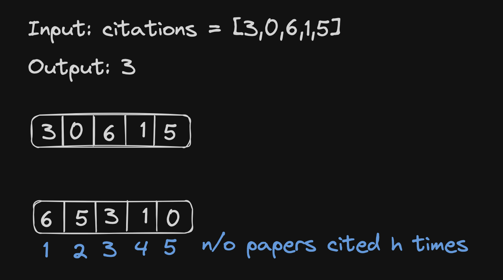

# <a href="https://leetcode.com/problems/h-index/?envType=study-plan-v2&envId=top-interview-150">274 H-Index</a>

### Description

> Tags: *Array, Sorting, Counting Sort*

Given an array of integers `citations` where `citations[i]` is the number of citations a researcher received for their `i`th paper, return the researcher's `h-index`.

According to the definition of `h-index` on Wikipedia: The `h-index` is defined as the maximum value of `h` such that the given researcher has published at least `h` papers that have each been cited at least `h` times.

 

Example 1:
```
Input: citations = [3,0,6,1,5]
Output: 3
Explanation: [3,0,6,1,5] means the researcher has 5 papers in total and each of them had received 3, 0, 6, 1, 5 citations respectively.
Since the researcher has 3 papers with at least 3 citations each and the remaining two with no more than 3 citations each, their h-index is 3.
```
Example 2:
```
Input: citations = [1,3,1]
Output: 1
```
  
> Understand the problem

1. `citations[i]` number of citations researcher receives for the `i`th paper
1. at least h papers have been cited at least h times

> Drawings



> to code
- sort the array in reverse
- Iterate through the sorted array and compare each citation count to the number of papers that have at least that many citations
- if the citation count is greater than or equal to number of papers with atleast that many citations, we have found the h-index