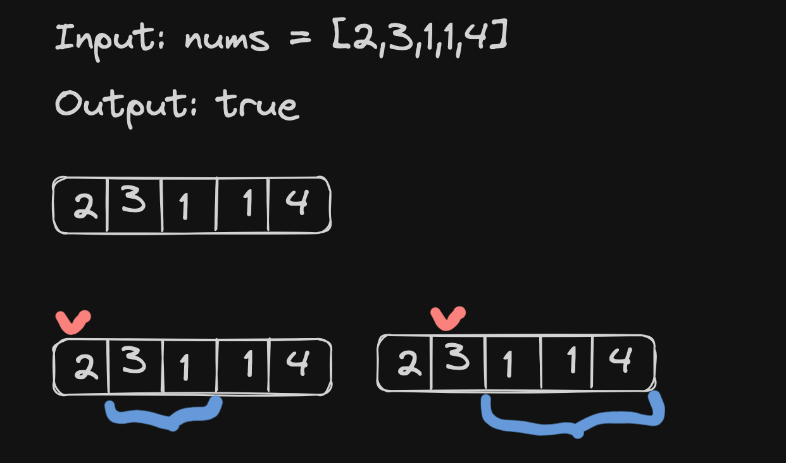

# <a href="https://leetcode.com/problems/jump-game-ii/?envType=study-plan-v2&envId=top-interview-150">45 Jump Game II</a>

### Description

> Tags: *Array, Dynamic Programming, Greedy*

You are given a 0-indexed array of integers `nums` of length `n`. You are initially positioned at `nums[0]`.

Each element `nums[i]` represents the maximum length of a forward jump from index `i`. In other words, if you are at `nums[i]`, you can jump to any `nums[i + j]` where:

`0 <= j <= nums[i]` and

`i + j < n`

Return the ***minimum number of jumps*** to reach `nums[n - 1]`. The test cases are generated such that you can reach `nums[n - 1]`.

 

Example 1:
```
Input: nums = [2,3,1,1,4]
Output: 2
Explanation: The minimum number of jumps to reach the last index is 2. Jump 1 step from index 0 to 1, then 3 steps to the last index.
```
Example 2:
```
Input: nums = [2,3,0,1,4]
Output: 2
```


> Understand the problem

1. checkout Jump Game
1. we have to find the minimum number of jumps to reach at the last elemnt
1. find the larget jump at each location from the begning of the array
1. take the count of the largest jumps

> Drawings



> to code
- `jumps = 0` to count the jumps
- loop through the array and find the larget jump at current position
- if the larget jump reaches at the last element return `jumps` else increment `jumps`
- we might need two pointers to find the largest jump of current element