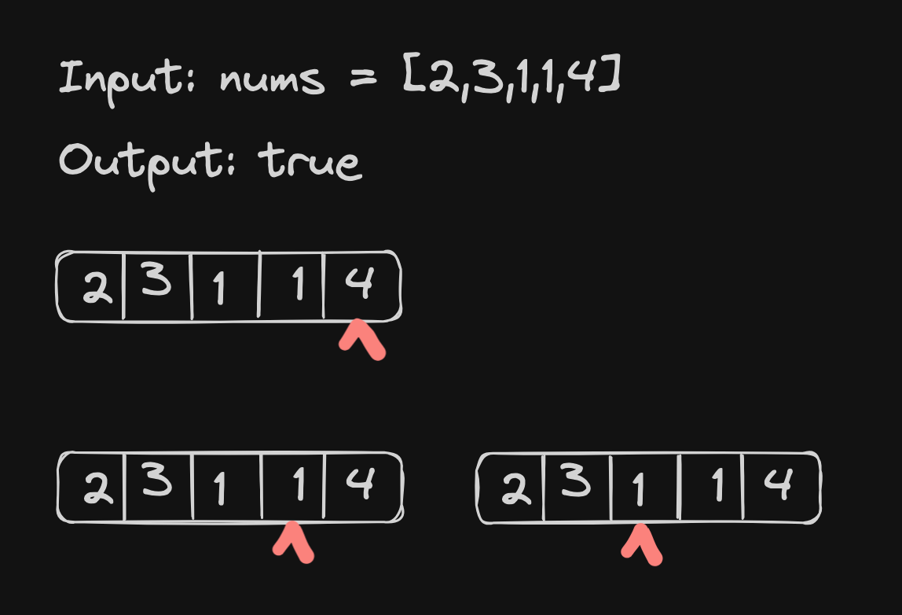

# <a href=""></a>

### Description

> Tags: *Array, Dynamic Programming, Greedy*

You are given an integer array `nums`. You are initially positioned at the array's first index, and each element in the array represents your maximum jump length at that position.

Return `true` if you can reach the last index, or `false` otherwise.

 

Example 1:
```
Input: nums = [2,3,1,1,4]
Output: true
Explanation: Jump 1 step from index 0 to 1, then 3 steps to the last index.
```
Example 2:
```
Input: nums = [3,2,1,0,4]
Output: false
Explanation: You will always arrive at index 3 no matter what. Its maximum jump length is 0, which makes it impossible to reach the last index.
```

> Understand the problem

1. maximum jump length = value + index
1. the goal is to reach at the last element
1. to reach last element, we can check if all the `elem` + index reaches at last element (bruteforce)
1. a better way to loop through the array in reverse order
1. check if we can reach the last element from second last element
1. if so we have to reach at the second last element from its previous element.

> Drawings



> to code
- a pointer `goal` to keep track of the last element (initially at last element)
- loop thourgh the array in reverse order and check if the `cur + index <= goal`