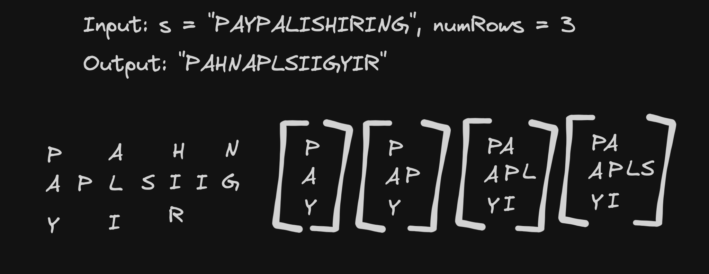

# <a href="https://leetcode.com/problems/zigzag-conversion/?envType=study-plan-v2&envId=top-interview-150">6 Zig-Zag Conversion</a>

### Description

> Tags: *String*

The string `"PAYPALISHIRING"` is written in a zigzag pattern on a given number of rows like this: (you may want to display this pattern in a fixed font for better legibility)
```
P   A   H   N
A P L S I I G
Y   I   R
```
And then read line by line: `"PAHNAPLSIIGYIR"`

Write the code that will take a string and make this conversion given a number of rows:
```
string convert(string s, int numRows);
```

Example 1:
```
Input: s = "PAYPALISHIRING", numRows = 3
Output: "PAHNAPLSIIGYIR"
```
Example 2:
```
Input: s = "PAYPALISHIRING", numRows = 4
Output: "PINALSIGYAHRPI"
Explanation:
P     I    N
A   L S  I G
Y A   H R
P     I
```
Example 3:
```
Input: s = "A", numRows = 1
Output: "A"
```
> Understand the problem

1. we have to convert the string into a specific pattern
1. the pattern is like a matrix of chars
1. if we look at the output we have 3 movements through the string - down, right, up
1. use two pointers one for horizontal movement, another for vertical.

> Drawings



> to code
- initalise an array of `[""] * numRows`
- use two pointers `count` and `step`. `count` represent the index of char in the output array and `step` represent we have to go up or down
- at each point append the letter to the array[count]