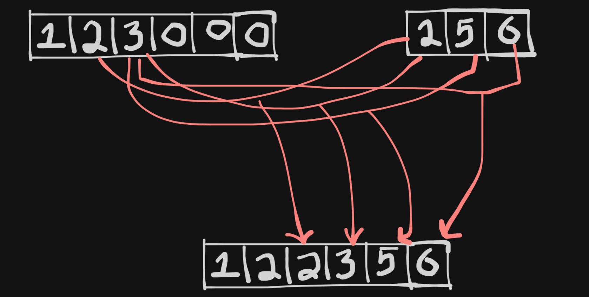

# <a href="https://leetcode.com/problems/merge-sorted-array/?envType=study-plan-v2&envId=top-interview-150">88. Merge Sorted Array</a>

Tags: *Array, Two Pointers, Sorting*

You are given two integer arrays `nums1` and `nums2`, sorted in non-decreasing order, and two integers `m` and `n`, representing the number of elements in `nums1` and `nums2` respectively.

Merge `nums1` and `nums2` into a single array sorted in non-decreasing order.

The final sorted array should not be returned by the function, but instead be stored inside the array `nums1`. To accommodate this, `nums1` has a length of `m + n`, where the first `m` elements denote the elements that should be merged, and the last `n` elements are set to `0` and should be ignored. `nums2` has a length of `n`.

 
 

Example 1:

**Input**: nums1 = [1,2,3,0,0,0], m = 3, nums2 = [2,5,6], n = 3

**Output**: [1,2,2,3,5,6]

**Explanation**: The arrays we are merging are [1,2,3] and [2,5,6].
The result of the merge is [1,2,2,3,5,6] with the underlined elements coming from nums1.
 
 
Example 2:

**Input**: nums1 = [1], m = 1, nums2 = [], n = 0

**Output**: [1]

**Explanation**: The arrays we are merging are [1] and [].
The result of the merge is [1].
 
 
Example 3:

**Input**: nums1 = [0], m = 0, nums2 = [1], n = 1

**Output**: [1]

**Explanation**: The arrays we are merging are [] and [1].
The result of the merge is [1].
Note that because m = 0, there are no elements in nums1. The 0 is only there to ensure the merge result can fit in nums1.

# Solution

> Understand the problem
1. Two sorted arrays
2. we have to modify the first array
3. length of the first array is **already** `m+n`

> to code

- Compare the max element (last element) of both arrays and fill the first array with the highest of both.
- Use 3 pointers i, j, k for iteration and comparison of two arrays.
