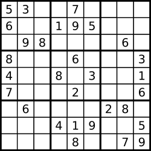

# <a href="https://leetcode.com/problems/valid-sudoku/?envType=study-plan-v2&envId=top-interview-150">36 Valid Sudoku</a>

### Description

> Tags: *Array, Hash Table, Matrix*

Determine if a `9 x 9` Sudoku board is valid. Only the filled cells need to be validated according to the following rules:

Each row must contain the digits `1-9` without repetition.
Each column must contain the digits `1-9` without repetition.
Each of the nine `3 x 3` sub-boxes of the grid must contain the digits `1-9` without repetition.
Note:

A Sudoku board (partially filled) could be valid but is not necessarily solvable.
Only the filled cells need to be validated according to the mentioned rules.
 

Example 1:



```
Input: board = 
[["5","3",".",".","7",".",".",".","."]
,["6",".",".","1","9","5",".",".","."]
,[".","9","8",".",".",".",".","6","."]
,["8",".",".",".","6",".",".",".","3"]
,["4",".",".","8",".","3",".",".","1"]
,["7",".",".",".","2",".",".",".","6"]
,[".","6",".",".",".",".","2","8","."]
,[".",".",".","4","1","9",".",".","5"]
,[".",".",".",".","8",".",".","7","9"]]
Output: true
```
Example 2:
```
Input: board = 
[["8","3",".",".","7",".",".",".","."]
,["6",".",".","1","9","5",".",".","."]
,[".","9","8",".",".",".",".","6","."]
,["8",".",".",".","6",".",".",".","3"]
,["4",".",".","8",".","3",".",".","1"]
,["7",".",".",".","2",".",".",".","6"]
,[".","6",".",".",".",".","2","8","."]
,[".",".",".","4","1","9",".",".","5"]
,[".",".",".",".","8",".",".","7","9"]]
Output: false
Explanation: Same as Example 1, except with the 5 in the top left corner being modified to 8. Since there are two 8's in the top left 3x3 sub-box, it is invalid.
```


> Understand the problem

1. here the valid sudoku may have partially filled columns
1. a valid sodoku may not be solvable
1. to be valid it has to satisfy three conditions
    1. row without repeating numbers
    1. col without repeating numbers
    1. `3x3` without reapeating numbers
1. to find duplicates we can use a HashSet

> Drawings


> to code

- create three `defaultdict(set)` for rows, cols, and squares(`3x3`)
- loop through the enitre matrix and fill each of the hashsets with numbers correspoding to them
- if duplicates found `return False`