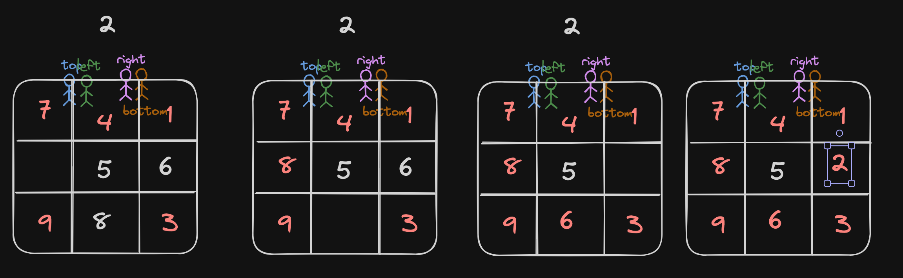

# <a href="https://leetcode.com/problems/rotate-image/?envType=study-plan-v2&envId=top-interview-150">48 Rotate Image</a>

### Description

> Tags: *Array, Math, Matrix*

You are given an `n x n` 2D `matrix` representing an image, rotate the image by 90 degrees (clockwise).

You have to rotate the image in-place, which means you have to modify the input 2D matrix directly. **DO NOT allocate** another 2D matrix and do the rotation.

 

Example 1:

```
Input: matrix = [[1,2,3],[4,5,6],[7,8,9]]
Output: [[7,4,1],[8,5,2],[9,6,3]]
```
Example 2:

```
Input: matrix = [[5,1,9,11],[2,4,8,10],[13,3,6,7],[15,14,12,16]]
Output: [[15,13,2,5],[14,3,4,1],[12,6,8,9],[16,7,10,11]]
```

> Understand the problem

1. we are not allocated to create another matrix
1. the rotation should be in in-place
1. there is a pattern for rotation (end elements to opposite end and the mid element (if n is odd) will never change)

> Drawings



> to code

- initialise 4 pointers left, top, bottom and right
- from left to right, set top to left and bottom to right
    - save the `topLeft` element
    - move the `bottomLeft` to `topLeft`
    - move the `bottomRight` to `bottomLeft`
    - move the `topRight` to `bottomRight`
    - move `topLeft` to `topRight`