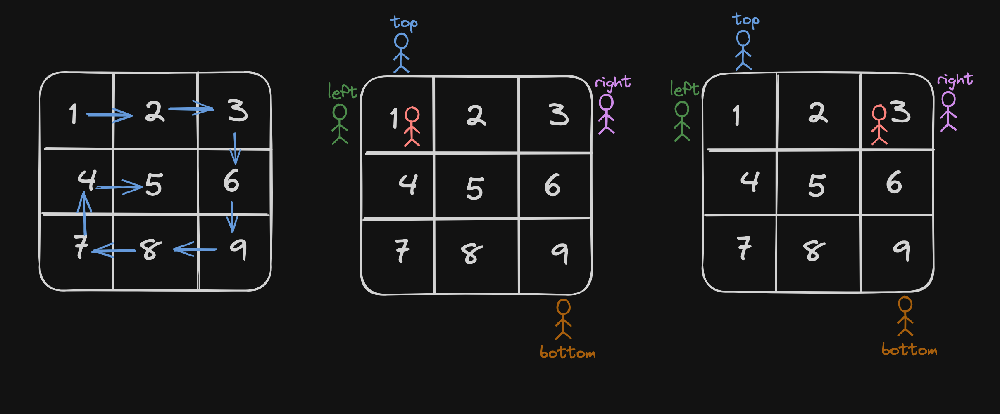
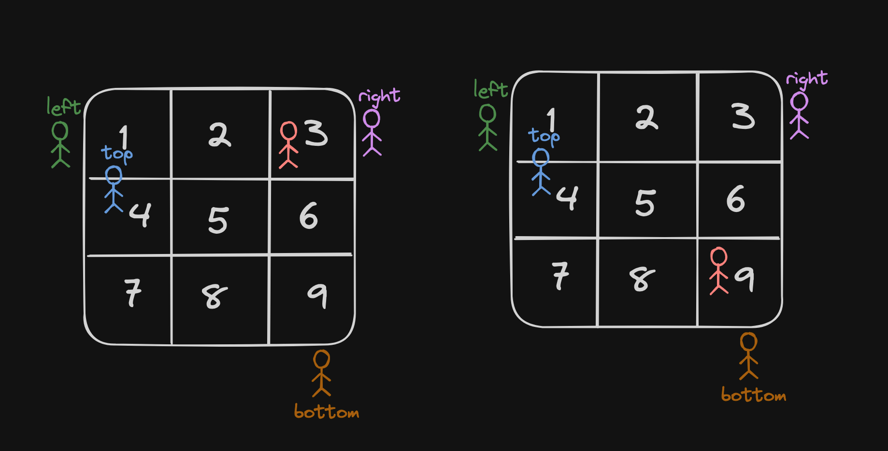
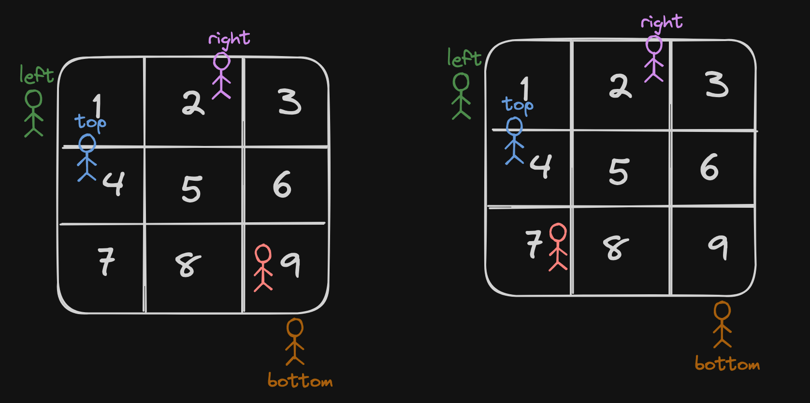
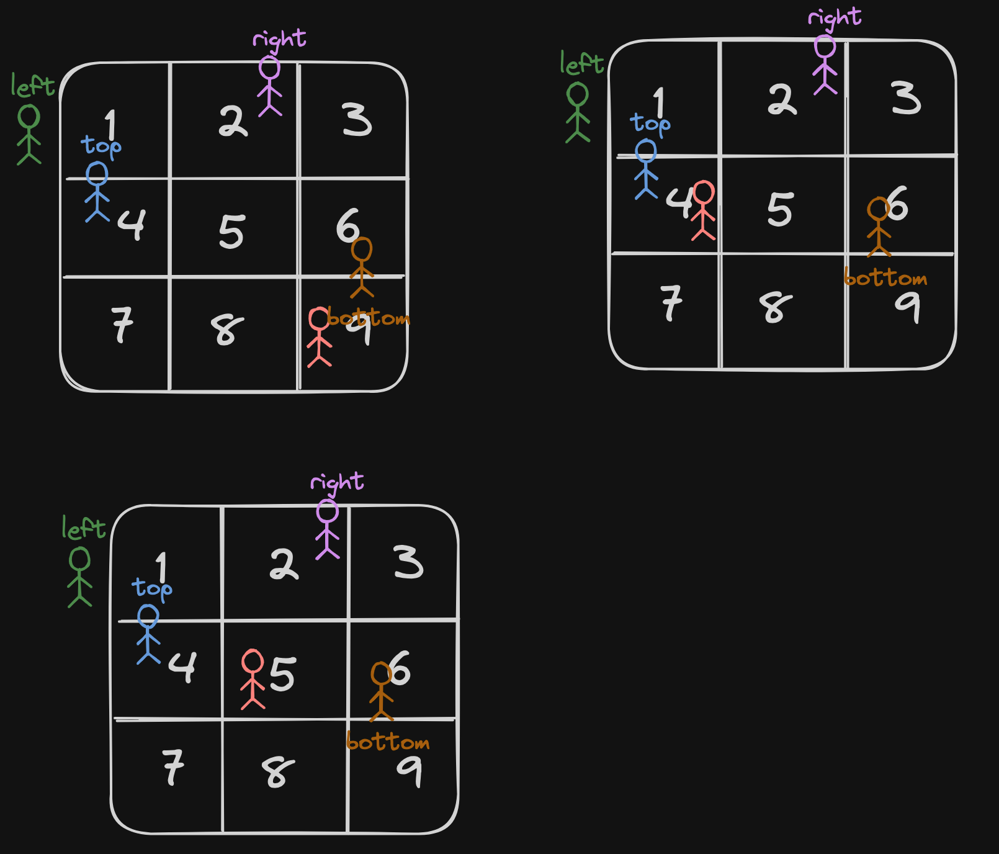

# <a href="https://leetcode.com/problems/spiral-matrix/?envType=study-plan-v2&envId=top-interview-150">54 Spiral Matrix</a>

### Description

> Tags: *Array, Matrix, Simulation*

Given an `m x n` matrix, return all elements of the `matrix` in spiral order.

 

Example 1:

```
Input: matrix = [[1,2,3],[4,5,6],[7,8,9]]
Output: [1,2,3,6,9,8,7,4,5]
```
Example 2:


```
Input: matrix = [[1,2,3,4],[5,6,7,8],[9,10,11,12]]
Output: [1,2,3,4,8,12,11,10,9,5,6,7]
```
  
> Understand the problem

1. 

> Drawings






> to code

- initialise 4 pointers top, left, bottom and right
- loop through the arrya -> condition `left < right` and `top < bottom`
- first a for loop to go right, the to bottom, then to left, then to up