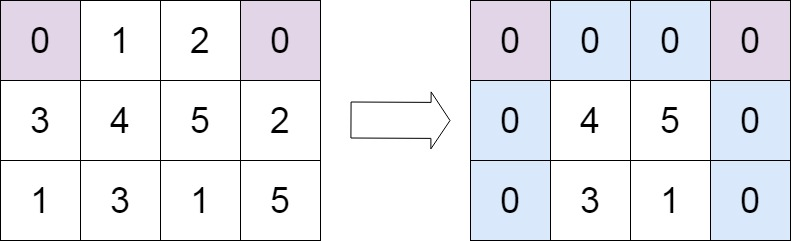

# <a href="https://leetcode.com/problems/set-matrix-zeroes/?envType=study-plan-v2&envId=top-interview-150">73 Set Matrix Zeroes</a>

### Description

> Tags: *Array, Hash Table, Matrix*

Given an `m x n` integer matrix `matrix`, if an element is `0`, set its entire row and column to `0`'s.

You must do it in place.

 

Example 1:

```
Input: matrix = [[1,1,1],[1,0,1],[1,1,1]]
Output: [[1,0,1],[0,0,0],[1,0,1]]
```
Example 2:

```
Input: matrix = [[0,1,2,0],[3,4,5,2],[1,3,1,5]]
Output: [[0,0,0,0],[0,4,5,0],[0,3,1,0]]
```

> Understand the problem

1. must do it in place
1. similar to rotate image (instead of rotation here we have to replace)
1. if we know the indices of zeros we can easily convert the corresponding columns and rows to 0's

> Drawings


> to code

- initialise and array to store the location of 0's
- loop through the array and find the elements with value 0 and append its location(i, j) to the above array
- now loop through the array of zero locations and filling each column and row with another for loop for both.