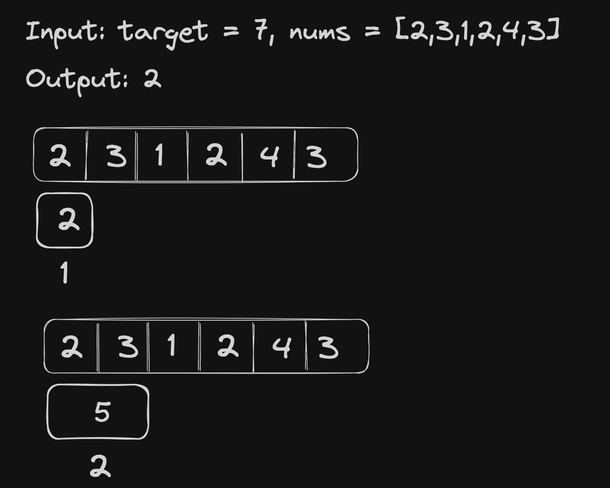
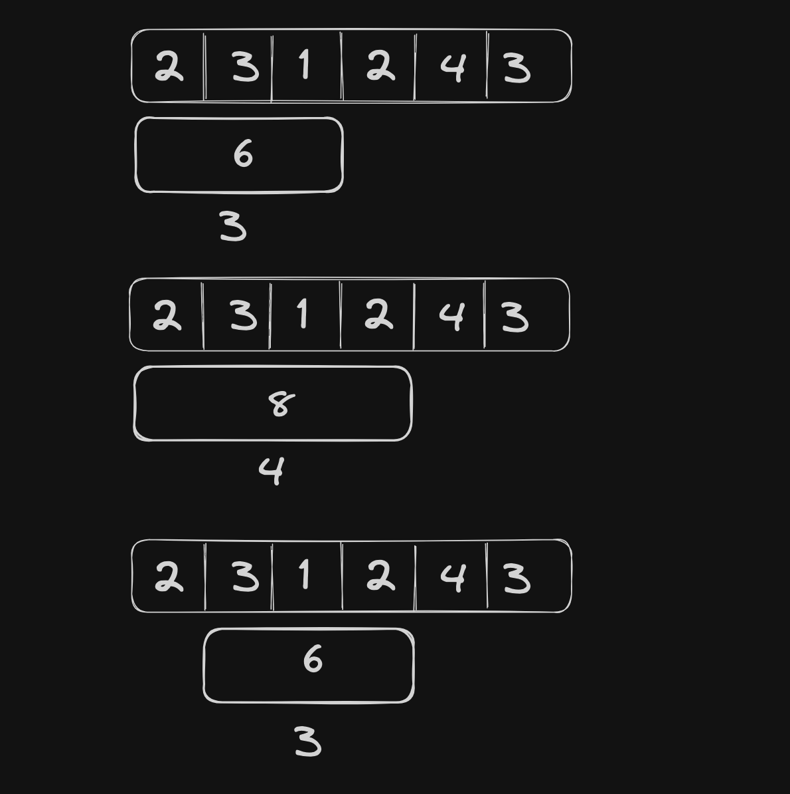
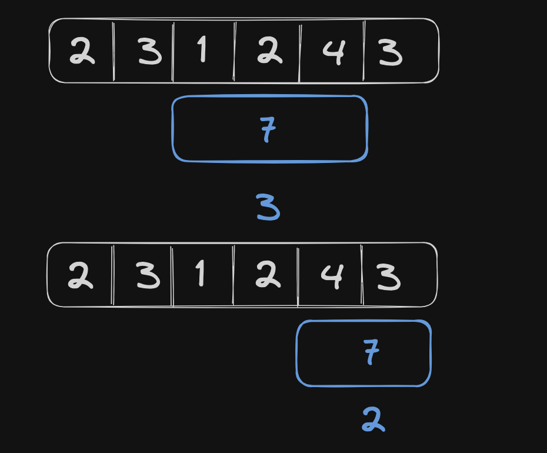

# <a href="https://leetcode.com/problems/minimum-size-subarray-sum/?envType=study-plan-v2&envId=top-interview-150">209 Minimum Size Subarray Sum</a>

### Description

> Tags: *Array, Binary Search, Sliding Window, Prefix Sum*

Given an array of positive integers `nums` and a positive integer `target`, return the *minimal length* of a 
subarray whose sum is greater than or equal to `target`. If there is no such subarray, return `0`instead.

 

Example 1:
```
Input: target = 7, nums = [2,3,1,2,4,3]
Output: 2
Explanation: The subarray [4,3] has the minimal length under the problem constraint.
```
Example 2:
```
Input: target = 4, nums = [1,4,4]
Output: 1
```
Example 3:
```
Input: target = 11, nums = [1,1,1,1,1,1,1,1]
Output: 0
```
  
> Understand the problem

1. here we need a subarray -> two pointers or sliding window
1. length of the subarray has to min -> sliding window with length = 1
1. sum(subarr) == target

> Drawings





> to code

- init the `res` to -ve infinity
- a `left` pointer to keep track of the sliding window left and `right` pointer will be our for loop pointer
- loop through the array and find the `total` from `left` to `right`
- if the `total` equals or exceeds `target` remove elements from left of the sliding window until the  `total` < `target`
- update the `res` to `min(res)` when `total` exceeds `target`