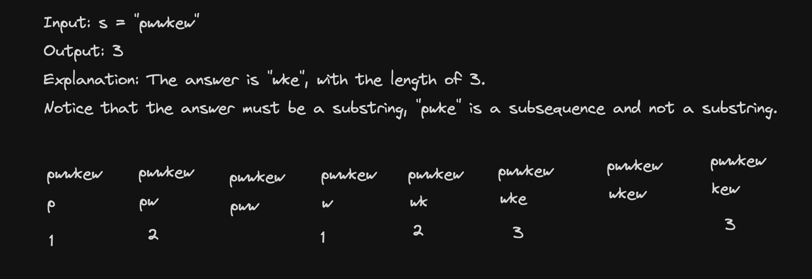

# <a href="https://leetcode.com/problems/longest-substring-without-repeating-characters/?envType=study-plan-v2&envId=top-interview-150">3 Longest Substring Without Repeating Characters</a>

### Description

> Tags: *Hash Table, String, Sliding Window*

Given a string `s`, find the length of the longest 
substring without repeating characters.

 

Example 1:
```
Input: s = "abcabcbb"
Output: 3
Explanation: The answer is "abc", with the length of 3.
```
Example 2:
```
Input: s = "bbbbb"
Output: 1
Explanation: The answer is "b", with the length of 1.
```
Example 3:
```
Input: s = "pwwkew"
Output: 3
Explanation: The answer is "wke", with the length of 3.
Notice that the answer must be a substring, "pwke" is a subsequence and not a substring.
```
  
> Understand the problem

1. substring - continues therefore, sliding window?
1. longest - we need to keep track of the length of the substring
1. unique characters - hashset?


> Drawings



> to code

- init `n`, `left`, `maxLen` and `charSet` respectivly for length of string, left pointer, maximum length and hashset
- loop though the string and if the char is not in hashset append and update `maxLen`
- while the char in hashset remove the left element from the hashset and increase the left pointer by 1 at last add the char to hashset