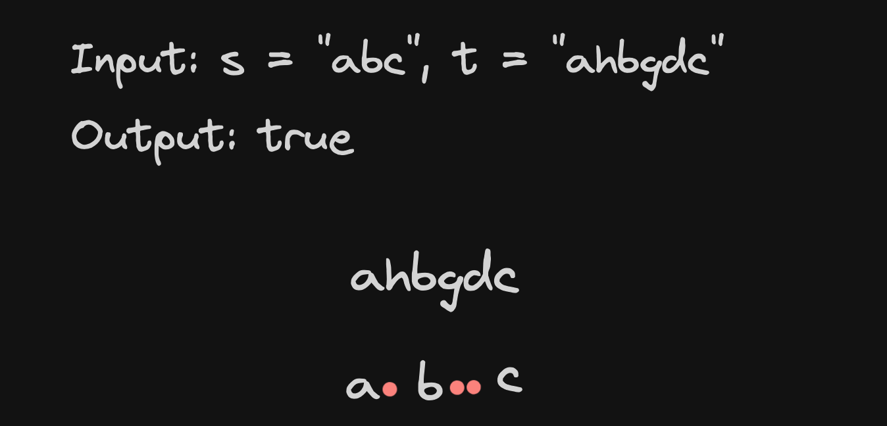

# <a href="https://leetcode.com/problems/is-subsequence/description/?envType=study-plan-v2&envId=top-interview-150">392 Is Subsequence</a>

### Description

> Tags: *Two Pointers, String, Dynamic Programming*

Given two strings `s` and `t`, return true if `s` is a subsequence of `t`, or false otherwise.

A subsequence of a string is a new string that is formed from the original string by deleting some (can be none) of the characters without disturbing the relative positions of the remaining characters. (i.e., "ace" is a subsequence of "abcde" while "aec" is not).

 
Example 1:
```
Input: s = "abc", t = "ahbgdc"
Output: true
```
Example 2:
```
Input: s = "axc", t = "ahbgdc"
Output: false
```

> Understand the problem

1. if s is a subsequence of t then len(s) < len(t)
1. subsequence - relative order matters
1. compare the each char of both strings

> Drawings



> to code
- use two pointers i, j to iterate through both arrays
- increment both of them if they match, else increment j (t pointer)
- return i reaches at the end of the string